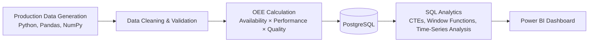
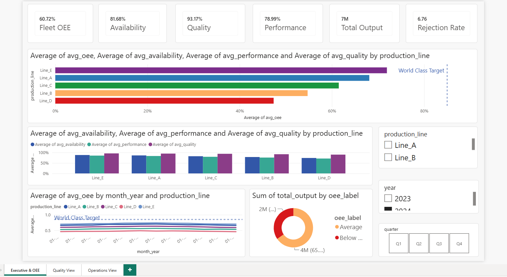
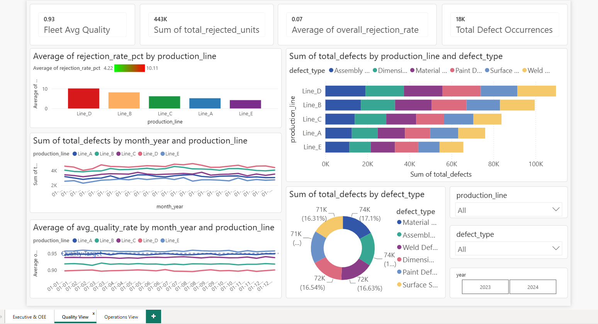
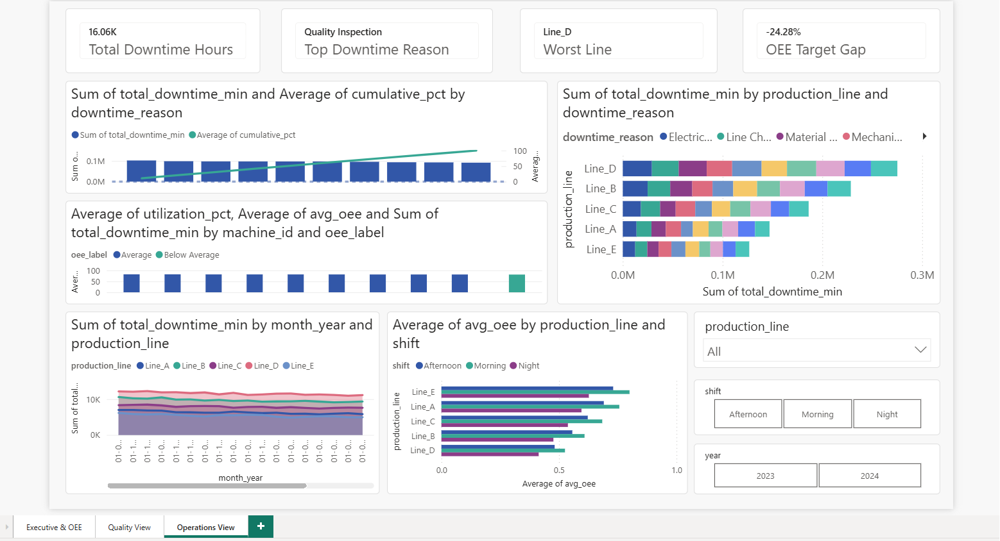

# Manufacturing Operations Intelligence Dashboard


## Overview

Designed and developed an end-to-end manufacturing analytics platform to monitor production efficiency across multiple production lines using **Overall Equipment Effectiveness (OEE)**, the industry-standard KPI for manufacturing performance.

The solution combines **Python, PostgreSQL, SQL analytics, and Power BI** to identify operational bottlenecks, quantify production losses, and support data-driven decision-making across manufacturing operations.

---

## Business Problem

Manufacturing leaders need visibility into three critical operational dimensions:

- **Availability** – Is equipment running when scheduled?
- **Performance** – Is production meeting target throughput?
- **Quality** – Are products being produced without defects?

Without centralized analytics, identifying underperforming production lines, shifts, and machines becomes difficult, leading to reduced throughput and increased operational costs.

This project delivers a scalable analytics solution that tracks operational efficiency and highlights the root causes of production losses through downtime and quality analysis.

---

## Objectives

- Calculate and monitor OEE across production lines
- Identify low-performing lines, machines, and shifts
- Analyze downtime drivers and defect trends
- Track operational performance over time
- Deliver executive and operational dashboards for decision-making

---

## Project Architecture



## Dataset

Synthetic manufacturing dataset designed to replicate real-world production environments.

### Data Scope

- **2 years of production history (2023–2024)**
- **10,950 production records**
- **5 production lines**
- **10 manufacturing machines**
- **3 work shifts**
- **5 product categories**
- **10 downtime categories**
- **6 defect classifications**

### Simulated Operational Factors

- Shift-based productivity variation
- Seasonal production fluctuations
- Equipment reliability differences
- Quality degradation patterns
- Line-specific performance baselines

---

## Technology Stack

| Area | Tools |
|--------|--------|
| Data Generation | Python, NumPy, Pandas |
| Data Processing | Pandas |
| Database | PostgreSQL |
| SQL Analytics | PostgreSQL, Window Functions, CTEs |
| Visualization | Power BI, Matplotlib |
| Version Control | Git, GitHub |

---

## Analytical Framework

### Overall Equipment Effectiveness (OEE)

OEE was used as the primary manufacturing KPI.

### Formula

```text
OEE = Availability × Performance × Quality
```

Where:

- Availability = Run Time / Planned Production Time
- Performance = Actual Output / Ideal Output
- Quality = Good Units / Total Units Produced

### World-Class Manufacturing Benchmark

**OEE ≥ 85%**

---

## Key Analyses Performed

### Production Performance Analysis

- OEE comparison across production lines
- Monthly trend analysis
- Shift performance benchmarking
- OEE component breakdown (Availability, Performance, Quality)

### Downtime Analytics

- Downtime Pareto analysis
- Root-cause identification
- Machine-level downtime monitoring
- Production loss quantification

### Quality Analytics

- Defect type analysis
- Rejection rate tracking
- Quality trend monitoring
- Production line quality comparison

### Operational Benchmarking

- Best vs worst performing production lines
- Shift efficiency comparison
- Quarterly performance improvement tracking

---

## SQL Analytics

Developed **12 business-focused SQL analyses** using:

- Common Table Expressions (CTEs)
- Window Functions
- Ranking Functions
- Time-Series Analysis
- LAG/LEAD Functions

### Example Business Questions Answered

- Which production line consistently performs below target OEE?
- How large is the performance gap between shifts?
- What are the primary drivers of downtime?
- Which machines contribute most to production losses?
- How has operational efficiency changed over time?

---

# Dashboard Preview

## Executive Operations Overview



---

## Quality Intelligence Dashboard



---

## Downtime & Operations Dashboard



---

## Dashboard Solution

Developed a **3-page Power BI Operations Dashboard** for manufacturing stakeholders.

### Executive Operations Overview

- Fleet-wide OEE KPI tracking
- OEE trend monitoring
- Production line benchmarking
- Availability, Performance, and Quality breakdown

### Quality Intelligence Dashboard

- Defect analysis
- Rejection trends
- Product quality monitoring
- Defect category distribution

### Downtime & Utilization Dashboard

- Downtime Pareto analysis
- Machine utilization tracking
- Shift performance comparison
- Root-cause visibility

---

## Key Insights Generated

| Business Insight | Result |
|------------------|--------|
| Best Performing Line | Line_E (OEE: 83%) |
| Lowest Performing Line | Line_D (OEE: 54%) |
| Fleet Average OEE | 70% |
| Largest Downtime Driver | Mechanical Failure (21%) |
| Highest Rejection Rate | Line_D (8.04%) |
| Largest Shift Performance Gap | 29% OEE Difference |
| Continuous Underperformer | Line_D Across All 24 Months |

### Operational Findings

- Mechanical failures were responsible for the largest share of production downtime.
- Night shift performance consistently lagged morning shift performance across all production lines.
- Line_D showed persistent operational inefficiencies and quality losses throughout the analysis period.
- Operational performance demonstrated gradual improvement during the second half of 2024.

---

## Business Impact

This solution demonstrates how manufacturing organizations can:

- Monitor operational efficiency using industry-standard KPIs
- Reduce downtime through root-cause visibility
- Improve quality performance through defect analysis
- Identify production bottlenecks early
- Support continuous improvement initiatives with data-driven insights

---

## Skills Demonstrated

### Data Analytics

- KPI Design & Measurement
- Manufacturing Analytics
- Root Cause Analysis
- Trend Analysis
- Performance Benchmarking

### SQL

- Advanced Joins
- Window Functions
- CTEs
- Ranking & Aggregations
- Time-Series Analysis

### Power BI

- Interactive Dashboards
- DAX Measures
- KPI Reporting
- Operational Visualization

### Python

- Data Generation
- Data Cleaning
- Feature Engineering
- Exploratory Data Analysis

---

## Repository Structure

```text
manufacturing_intelligence/
│
├── data/
├── src/
├── sql/
├── dashboard_screenshots/
│   ├── executive_overview.png
│   ├── quality_view.png
│   └── operations_view.png
│
├── config.py
├── main.py
├── requirements.txt
└── README.md
```

---

## Project Outcome

Built a production-style manufacturing intelligence platform that transforms raw operational data into actionable business insights through Python, SQL, PostgreSQL, and Power BI, enabling continuous monitoring of equipment effectiveness, production quality, and operational performance.